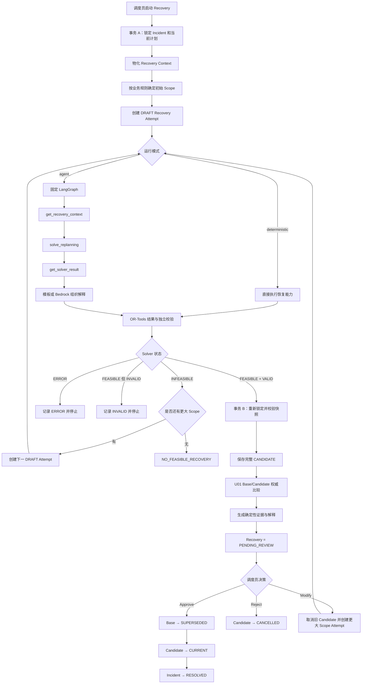

# PenroseRoute Recovery Agent 工作流（扩展前记录）

> 当前 P1 扩展已改变模型调用时序，并启用只读对话入口。最新运行契约见 [P1_AGENT_READONLY_API.md](P1_AGENT_READONLY_API.md)，交付与依赖状态见 [P1_AGENT_WORKSTREAM_STATUS.md](P1_AGENT_WORKSTREAM_STATUS.md)。以下保留扩展前的流程说明，不能用于推断当前模型调用或接口状态。

## 1. Agent 的定位

当前 Agent 只参与配送异常后的恢复规划。正常配送计划仍由固定的 Planning Workflow 生成，不经过 Agent。

Agent 的职责是：

1. 读取业务层已经物化、校验过的恢复上下文。
2. 触发一次受控的恢复求解能力。
3. 读取 OR-Tools 结果和独立校验结果。
4. 将可信事实组织为调度员可阅读的解释。

Agent 不负责判断异常类型、选择重规划范围、生成路线数字、写数据库、扫描告警或批准候选方案。最终计划切换必须由调度员通过独立审批接口完成。

## 2. 入口与运行模式

公开入口统一为：

```http
POST /api/incidents/{incident_id}/recovery
Authorization: Bearer <dispatcher-token>
Content-Type: application/json

{}
```

客户端不能提交 prompt、scope、vehicle_id、路线或审批指令。内部运行模式由服务端配置决定：

```dotenv
RECOVERY_ORCHESTRATION_MODE=agent
AGENT_EXPLANATION_PROVIDER=template
```

- `RECOVERY_ORCHESTRATION_MODE=deterministic`：跳过 LangGraph，直接执行同一套确定性恢复能力。
- `RECOVERY_ORCHESTRATION_MODE=agent`：使用固定 LangGraph 包装确定性恢复能力。
- `AGENT_EXPLANATION_PROVIDER=template`：使用本地模板，不依赖模型。
- `AGENT_EXPLANATION_PROVIDER=bedrock`：允许 Bedrock 对可信事实 ID 排序；失败时自动回退模板。

公开 API 不暴露模式选择，因此两种模式使用相同的业务状态、候选表和审批接口。

## 3. 总体工作流



## 4. 事务 A：准备恢复尝试

业务层首先在短事务中完成：

1. 锁定异常记录和异常关联的当前配送计划。
2. 拒绝不存在的异常、已有待审核候选或已启动过但不允许重复执行的异常。
3. 按异常类型确定初始重规划范围。
4. 从数据库物化不可变的 `RecoveryContext`。
5. 创建状态为 `DRAFT` 的 `RecoveryPlan` Attempt。
6. 提交事务，然后在事务外运行求解器和可选模型。

`RecoveryContext` 包含：

- Incident、Base Plan、Attempt ID 和序号。
- 当前业务时间和快照令牌。
- 受影响订单及检测时执行状态。
- Completed Freeze 和 Handover 标记。
- 当前路线、Stop、计划成员关系。
- 可用车辆、司机、车人绑定、容量和位置。
- 事故位置或商家延迟秒数。
- 服务端确定的重规划范围。

模型不能修改这些事实。

## 5. Scope 的确定性扩展

恢复范围由业务规则控制：

| 顺序 | Scope | 含义 |
| --- | --- | --- |
| 1 | `AFFECTED_ROUTE` | 优先只处理受影响路线和其允许资源 |
| 2 | `CROSS_ROUTE` | 允许使用其他未被保留路线占用的资源 |
| 3 | `ALL_REMAINING` | 允许重排所有未完成任务，同时保持硬约束 |

只有 OR-Tools 明确返回 `INFEASIBLE` 时才扩大范围。

以下情况不会自动扩大范围：

- 求解器异常或超时。
- 输出契约错误。
- 独立 Validator 判定结果无效。
- 数据库快照、当前计划或执行事实已变化。
- 已经到达 `ALL_REMAINING`。

## 6. Agent 图和受控工具

Agent 图是固定的四节点流程：


Agent 只有三个工具：

| 工具 | 作用 | 限制 |
| --- | --- | --- |
| `get_recovery_context` | 读取已物化上下文 | 只读 |
| `solve_replanning` | 调用绑定到当前 Attempt 的恢复能力 | 无可编辑参数；同一实例只执行一次 |
| `get_solver_result` | 读取求解和校验结果 | 必须先完成求解 |

工具层不会向模型暴露数据库 Session、Repository、SQL、审批、告警扫描、资源修改或任意代码执行能力。

即使 LangGraph 或模型调用失败，工作流也不会重复执行一个已经开始的求解。能够安全回退时只回退解释模板，不改变求解结果和业务状态。

## 7. OR-Tools 和独立校验

Agent 不计算路线。`solve_replanning` 最终调用确定性恢复能力，由 OR-Tools 处理：

- Pickup/Delivery 先后关系。
- 容量约束。
- 时间窗与服务时间。
- 可用车辆和司机绑定。
- 已取货订单的初始载重。
- Handover 后的配送先后关系。
- Scope 对允许车辆和订单集合的限制。

求解完成后，独立 Validator 重算并校验约束和指标。只有：

```text
solver_status = FEASIBLE
validation_status = VALID
```

才允许保存候选计划。

## 8. 事务 B：候选保存与并发复核

求解和解释结束后，业务层打开第二个短事务：

1. 再次锁定 Base Plan、Incident、车辆、司机和绑定关系。
2. 使用相同业务时间重新物化上下文。
3. 比较求解前后的上下文；发生变化则拒绝保存。
4. 将 Completed Stop、未受影响路线和新求解路线合并成完整候选。
5. 保存 `CANDIDATE` Delivery Plan、路线、成员关系和 Stops。
6. 将 Attempt 更新为 `PENDING_REVIEW`。
7. 将 Incident 更新为 `REVIEW`。

候选只是可供审核的计划版本，不会自动变成当前执行计划。

## 9. U01 权威比较与解释

候选持久化后，Agent 模式使用同一事务中的 Base/Candidate 快照调用 U01 比较能力。它是正式 Agent 证据的唯一来源。

证据包含：

- 每个订单的 Base/Candidate 分配状态。
- 原车辆和候选车辆。
- 是否改派、路线任务是否变化。
- Base/Candidate 配送 ETA 和差值。
- ETA 不可计算原因。
- Handover 订单。
- Completed Freeze 订单。
- 未分配订单。
- 受影响车辆。
- 比较时点、时间口径及当前是否仍可审核。

当前没有可比较的“剩余路程快照”，因此剩余距离和时长保持 `null`，并返回：

```text
NO_COMPARABLE_REMAINDER_SNAPSHOT
```

Agent 不会使用求解器局部路线总量填充这些全计划指标。

解释输出包含：

1. 事件、求解、校验和人工审核要求。
2. 影响订单、冻结任务和交接要求。
3. 重规划范围、改派订单和未变化订单。
4. 未分配订单、ETA 差异和不可用指标原因。
5. 剩余风险以及“候选尚未生效”的明确提示。

Bedrock 只能返回可信事实 ID 的顺序，不能修改事实内容。未知 ID、重复 ID、遗漏强制事实、超时或凭据错误都会回退本地模板。

## 10. 失败分支

| 条件 | Attempt 结果 | 是否创建 Candidate | 是否自动扩大 Scope |
| --- | --- | --- | --- |
| `INFEASIBLE` 且存在下一 Scope | 保存当前失败 Attempt | 否 | 是 |
| `INFEASIBLE` 且 Scope 耗尽 | `NO_FEASIBLE_RECOVERY` | 否 | 否 |
| Solver `ERROR` | 记录错误并返回集成错误 | 否 | 否 |
| Validation `INVALID` | 保存校验问题 | 否 | 否 |
| 快照发生变化 | 冲突错误 | 否 | 否 |
| `FEASIBLE + VALID` | `PENDING_REVIEW` | 是 | 否 |

任何失败分支都不会把部分求解结果保存成可审批候选。

## 11. 人工审批

审批与 Agent 完全分离：

```http
POST /api/recovery-plans/{recovery_id}/approve
POST /api/recovery-plans/{recovery_id}/reject
POST /api/recovery-plans/{recovery_id}/modify
```

### Approve

在一个数据库事务中完成：

```text
Base CURRENT → SUPERSEDED
Candidate CANDIDATE → CURRENT
Recovery PENDING_REVIEW → DECIDED/APPROVE
Incident REVIEW → RESOLVED
```

### Reject

```text
Candidate CANDIDATE → CANCELLED
Recovery PENDING_REVIEW → DECIDED/REJECT
Base 保持 CURRENT
Incident 回到 ASSESSING
```

### Modify

系统取消旧候选、保存 `MODIFY` 决定、创建下一固定 Scope 的 DRAFT Attempt，然后重新进入相同恢复流程。Agent 不能自行发起 Modify。

## 12. U06 风险告警边界

U06 已实现为独立的确定性告警生命周期：

- 从当前计划、订单 ETA 和配送时间窗计算风险。
- 创建、更新或解决 `RiskAlert`。
- 保存不可变的告警变化记录。
- 更新订单风险状态。

U06 不属于 Agent 工具集，Agent 不读取或修改告警表，也不启动告警扫描。告警结果可以通过业务层影响订单风险和异常处理，但不会绕过 Recovery Context、OR-Tools、Validator 或人工审批边界。

## 13. 关键代码位置

| 职责 | 文件 |
| --- | --- |
| 正式 Recovery API | `app/api/routes/recovery.py` |
| 恢复 Attempt 生命周期 | `app/modules/recovery/deterministic_workflow.py` |
| 正式 Agent 适配器 | `app/modules/recovery/orchestration.py` |
| LangGraph | `app/integrations/agent/graph.py` |
| 三项受控工具 | `app/integrations/agent/tools.py` |
| Agent DTO | `app/integrations/agent/contracts.py` |
| OR-Tools 恢复编排 | `app/modules/recovery/deterministic_orchestration.py` |
| U01 计划比较 | `app/modules/planning/comparison.py` |
| Agent 证据与解释 | `app/modules/recovery/evidence.py` |
| 人工决策 | `app/modules/decisions/service.py` |
| U06 告警生命周期 | `app/modules/operations/alerts.py` |

## 14. 当前保证和限制

当前测试保证：

- Agent 每个 Attempt 只调用一次求解能力。
- Agent 无数据库、审批和告警工具。
- 确定性模式启动不依赖 Agent 模块。
- 只有 `FEASIBLE + VALID` 创建候选。
- Approve 原子切换当前计划。
- Completed Freeze 和 Handover 进入完整候选。
- U01 证据不虚构 ETA、剩余距离或时长。
- U06 告警生命周期与 Agent 解耦。

当前完整后端测试为 **288 passed**。

当前限制：

- 距离和时长默认基于地理距离及固定速度，不是道路导航或实时交通。
- 没有真实 GPS、后台常驻异常检测或自动审批。
- Bedrock 是可选解释能力，不参与路线、Scope、状态或审批决策。
- 候选必须由调度员审核后才能生效。
